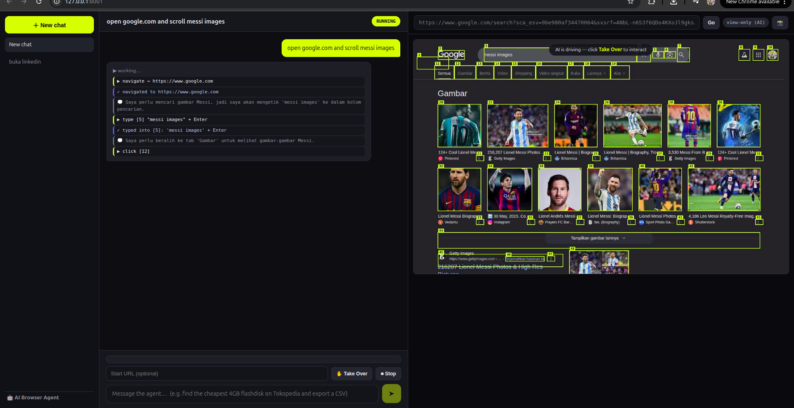

# AI Browser Agent

A browser driven by an LLM through a **prompt**. You give it a task (e.g. "find
the cheapest iPhone 15 on Amazon"), and the AI opens pages, types, clicks, and
scrolls until it's done. It uses any OpenAI-compatible LLM endpoint (vLLM,
Ollama, llama.cpp, …) as its brain.

The browser runs headless and is **streamed live into the dashboard** — no separate
window. Key feature: a **Take Over (Manual)** button. When you hit a Cloudflare /
CAPTCHA / login wall, click it and then **click, type and scroll right inside the
preview** (there's also an address bar to navigate manually). Click again to hand
control back to the AI and it continues from where it left off.



> Chats on the left (each keeps its own memory), the conversation transcript in the
> middle, and the live, interactive browser on the right.

```
[Control panel @ localhost:8001] ──HTTP──> [FastAPI] ──> [Agent loop] ──> [Playwright / headed Chromium]
        prompt · log · preview           start/pause/resume/stop      observe → LLM → act
```

## How it works

1. **observe** — JS is injected into the page to list every visible interactive
   element, number them, and draw a yellow labelled overlay (so you see exactly
   what the AI "sees").
2. **think** — the element list + page text is sent to the LLM, which returns a
   single JSON action.
3. **act** — Playwright executes it: click / type / scroll / navigate / etc.
4. Repeat until `done`, the `AGENT_MAX_STEPS` cap, or you stop it.

If the agent runs into a bot-check, it can choose the `request_manual` action
itself — which auto-pauses and asks you to take over.

### CSV / Excel export

Ask it to compile data and it will (e.g. *"go through this product list and make
an Excel with columns name, price, link"*). As the agent reads each item it
collects rows (`record_rows`), then writes a `.xlsx` or `.csv` file (`export`) to
`output/`. A **Download** button appears in the panel; files are also served at
`/output/<filename>`.

You don't have to wait for the agent to finish: once any rows are collected,
**Export CSV / Export Excel** buttons appear in the panel so you can dump the data
at any time — even after you pause or stop the run. Stopping a run also
auto-saves whatever was gathered, so data is never lost.

### Short-term memory (threads)

Give a task a **Thread ID** in the dashboard and the agent remembers what it did
earlier in that thread, so follow-ups keep context ("now add *it* to the cart"
resolves to what the previous task found). Reuse the same Thread ID to continue a
conversation; a badge shows whether that ID is **new** or already has **N
remembered** tasks. Memory is stored in SQLite by default (`memory.db`, zero
setup); set `AGENT_DATABASE_URL=postgresql://…` (and `pip install "psycopg[binary]"`)
to use Postgres instead. `AGENT_MEMORY_TURNS` (default 10) caps how many recent
turns are fed back to the model. It's the same idea as LangGraph's `thread_id`
checkpointer, kept native to avoid pulling a framework into the codebase.

### Screenshots

Ask the agent to capture something and it uses the `screenshot` action to save a
PNG of a specific element, a region, or the whole page to `output/`. You can also
hit the **📸 Capture** button in the preview bar to grab the current view yourself.
Captures show up as thumbnails in the panel (click to download).

## Setup

```bash
cd browser_agent
python -m venv venv && source venv/bin/activate
pip install -r requirements.txt
python -m playwright install chromium    # download the browser (once)
cp .env.example .env                      # then edit .env with your endpoint
cd backend && python main.py              # → http://127.0.0.1:8001
```

Open <http://127.0.0.1:8001>, type a task, click **Start**. A separate Chromium
window opens — that's where you can take over manually when needed.

## Configuration (.env)

| Var | Default | Purpose |
|---|---|---|
| `VLLM_BASE_URL` | `http://localhost:8000/v1` | OpenAI-compatible endpoint |
| `VLLM_MODEL` | `your-model-name` | model name |
| `VLLM_API_KEY` | `dummy` | API key (use `dummy` for local endpoints) |
| `AGENT_MAX_STEPS` | `30` | max autonomous steps (tick **♾️ Unlimited** in the UI to ignore the cap for a run) |
| `AGENT_HEADLESS` | `false` | **keep false** so manual takeover works |
| `AGENT_PORT` | `8001` | control-panel port |

## Tech stack

- **Backend**: Python 3.11, FastAPI + uvicorn, Playwright (headed Chromium),
  `openai` client for the LLM.
- **Frontend**: vanilla HTML/CSS/JS, no framework, no build step.
- No database, no auth — single user, one browser, one task at a time.

## Notes & limitations

- Runs **headless** — the page is streamed into the dashboard over a WebSocket and
  you interact right there, so it works on a headless server too (no display needed).
  Set `AGENT_HEADLESS=false` if you also want a real window. The Chrome profile is
  stored in `.profile/` so logins and Cloudflare clearance persist across runs.
- The agent reads the page through the DOM (text-based), so content inside
  cross-origin iframes, shadow DOM, or pure-canvas apps may be invisible to it.
- Page content is fed to the LLM, so a malicious page could attempt prompt
  injection. Run it only on sites you trust, and keep an eye on it.
- It won't auto-confirm payments / purchases / account deletions — it pauses and
  asks you first.
- For anti-bot sites (e.g. Tokopedia), install **Google Chrome** and keep
  `AGENT_BROWSER_CHANNEL=chrome` — its headless mode (with the `HeadlessChrome` UA
  token stripped) isn't blocked like Playwright's bundled headless shell. It still
  falls back to bundled Chromium if Chrome isn't installed.
- The first step can take ~30–60s if the model is cold-starting; calls retry
  automatically until the model is warm.
